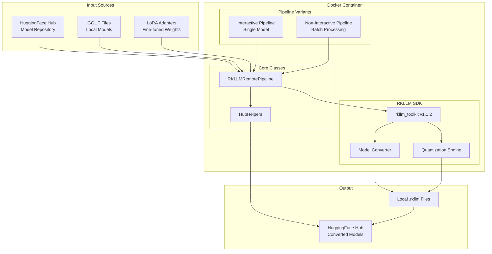
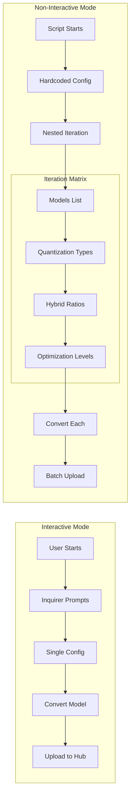
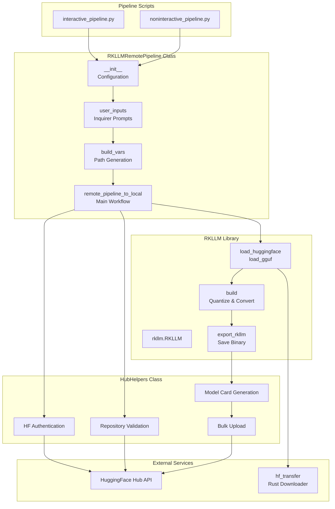
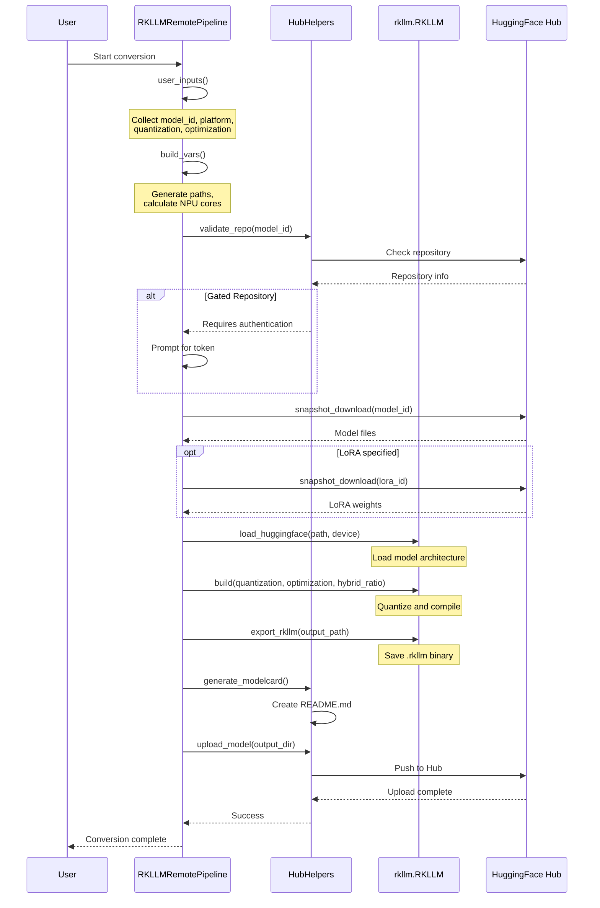
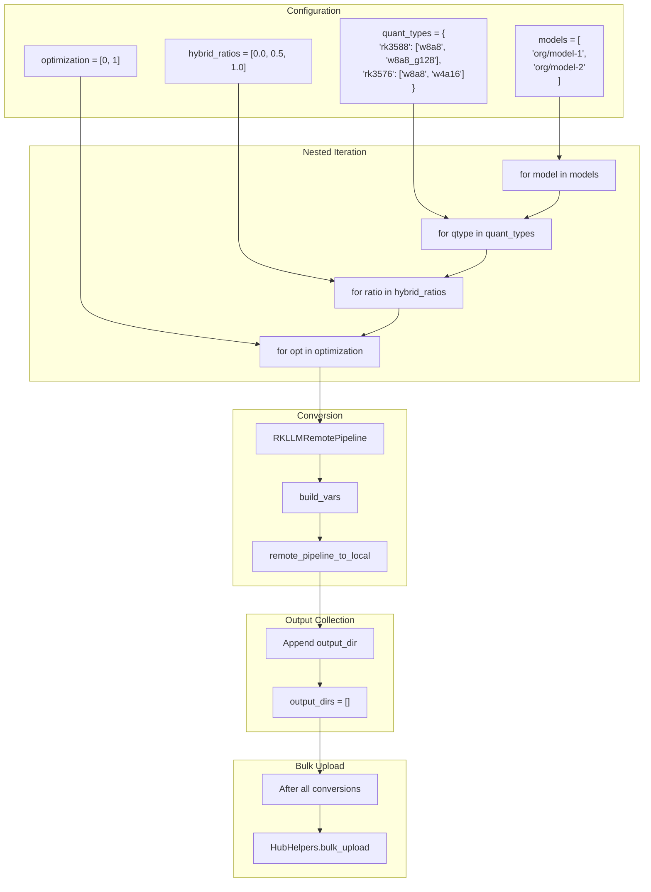
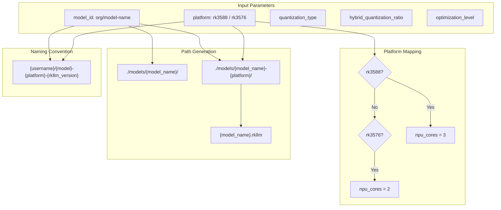
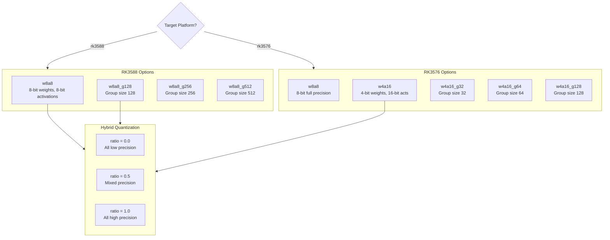
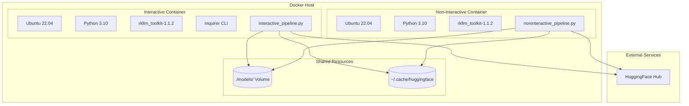

# Architecture Documentation

This document provides visual architecture documentation for RKLLM Toolkit - the model conversion pipeline for Rockchip NPU.

## Table of Contents

1. [System Overview](#system-overview)
2. [Pipeline Architecture](#pipeline-architecture)
3. [Component Interaction](#component-interaction)
4. [Data Flow](#data-flow)
5. [Batch Processing Flow](#batch-processing-flow)
6. [Model Conversion Pipeline](#model-conversion-pipeline)

---

## System Overview



---

## Pipeline Architecture

### Interactive vs Non-Interactive



---

## Component Interaction



---

## Data Flow

### Single Model Conversion



---

## Batch Processing Flow



---

## Model Conversion Pipeline

### Build Variables Generation



### Quantization Decision Tree



---

## Container Architecture



---

## Configuration Reference

### Pipeline Parameters

| Parameter | Type | Description |
|-----------|------|-------------|
| `model_id` | string | HuggingFace model repository ID |
| `lora_id` | string | Optional LoRA adapter ID |
| `platform` | enum | `rk3588` or `rk3576` |
| `quantization_type` | string | Quantization method (varies by platform) |
| `hybrid_quantization_ratio` | float | 0.0-1.0, precision mix ratio |
| `optimization_level` | int | 0 (none) or 1 (enabled) |

### Environment Variables

| Variable | Purpose |
|----------|---------|
| `HF_TOKEN` | HuggingFace authentication |
| `HF_HUB_ENABLE_HF_TRANSFER` | Enable Rust-based fast downloads |

---

## File Structure

```
rkllm-toolkit/
├── docker-interactive/
│   ├── Dockerfile              # Interactive container
│   ├── interactive_pipeline.py # User-prompted conversion
│   └── requirements.txt
├── docker-noninteractive/
│   ├── Dockerfile              # Batch container
│   ├── noninteractive_pipeline.py # Automated batch conversion
│   └── requirements.txt
├── models/                     # Model storage (mounted volume)
│   ├── {model-name}/           # Downloaded source model
│   └── {model-name}-{platform}/ # Converted .rkllm output
└── README.md
```

---

## Upload File Exclusions

Files excluded from HuggingFace upload:
- `*.safetensors` (original weights)
- `*.pt` (PyTorch checkpoints)
- `*.bin` (binary weights)
- `*.gguf` (GGUF format)

Files included:
- `*.rkllm` (converted model)
- `config.json` (model config)
- `tokenizer*.json` (tokenizer files)
- `README.md` (generated model card)
